# Pluto Health 🏥

> **Neuro-Symbolic Clinical Triage Engine with Safety-Critical Override System** - Professional-grade symptom analysis and clinical decision support utility.

[](https://nextjs.org/)
[](https://fastapi.tiangolo.com/)
[](./python_core/clinical_reasoning_engine.py)
[](./LICENSE)
[](https://github.com/realmihir60/pluto)

## 🌟 Overview

Pluto Health is a **safety-first clinical decision support system** designed to bridge the gap between alarming medical jargon and reassuring, methodical clinical assessment. It utilizes a unique **Neuro-Symbolic** approach: combining deterministic clinical protocols (Symbolic) with the natural language nuance of advanced LLMs (Neural).

### Core Pillars
- **Doctor-Like AI**: Reassuring, patient-centric language that avoids jargon while maintaining clinical authority.
- **Safety-Critical Overrides**: Hard rules for high-risk populations (infants, elderly, TIA patterns) that bypass normal logic.
- **Defensive Architecture**: Multi-layer validation (Safety Overrides → Rule Engine → LLM) that always biases towards safety.
- **Privacy by Design**: Automated PII scrubbing and de-identification before any clinical data hits the inference layer.

---

## 🚀 What's New in v4.1.0 (Launch Release)

### 🛡️ Safety Override System
The Clinical Reasoning Engine now includes **6 hard safety rules** that trigger BEFORE symptom matching:

| Rule | Trigger Pattern | Result |
|------|-----------------|--------|
| **TIA Detection** | Resolved neuro symptoms ("fine now") | 🚨 EMERGENCY |
| **Infant Safety** | <1 year + feeding/behavior change | ⚠️ URGENT |
| **Elderly Protection** | 65+ + cognitive change | ⚠️ URGENT |
| **Cardiac Alert** | Orthopnea + age >55 | ⚠️ URGENT |
| **DVT Risk** | Flight/immobility + leg symptoms | ⚠️ URGENT |
| **Metabolic Alert** | Sweating + tremor in adult | ⚠️ URGENT |

### 📊 Validation Results
- **87.5% pass rate** on 24 stress test edge cases
- **100% emergency detection** (MI, Stroke, SAH, Meningitis, Cauda Equina)
- **100% deceptive-critical detection** (DVT, Thunderclap, Cardiac mimic)
- **0 under-triage** of dangerous conditions

---

## 🏗️ Architecture: The Local Hybrid Model

Pluto operates in a **Hybrid Local Environment** to ensure zero-latency response times and maximum data sovereignty.

### System Stack
1. **Frontend (Port 3000)**: Next.js 15 (React 19) with premium glassmorphism UI
2. **Clinical Brain (Port 8000)**: Python FastAPI with 3-stage reasoning engine
3. **Unified Auth Bridge**: Shared Auth.js session between JS and Python
4. **Data Layer**: PostgreSQL (Supabase) via Prisma + SQLModel

```mermaid
graph TD
    A[Next.js Client :3000] -->|POST /api/triage| B[FastAPI Backend :8000]
    B -->|Stage 0| C[🛡️ Safety Overrides]
    C -->|Stage 1| D[Protocol Classifier]
    D -->|Stage 2| E[Criteria Matrix]
    E -->|Stage 3| F[Urgency Computer]
    F -->|Enrich| G[Groq Llama 3.3 70B]
    G -->|JSON Response| H[Next.js Client]
```



---

## ⚡ Quick Start (Local Setup)

### 1. Prerequisites
- **Node.js**: 20.x or higher
- **Python**: 3.10 or higher
- **PostgreSQL**: Local instance or Supabase
- **Groq API Key**: Obtain from [Groq Cloud](https://console.groq.com/)

### 2. Installation
```bash
# Clone the repository
git clone https://github.com/realmihir60/pluto.git
cd pluto

# Install Node dependencies
npm install
npx prisma generate

# Install Python dependencies
python3 -m venv venv
source venv/bin/activate
pip install -r requirements.txt
```

### 3. Environment Configuration
Create a `.env` file in the root directory:
```env
# API Keys
GROQ_API_KEY=gsk_...

# Database (Supabase recommended)
DATABASE_URL="postgresql://..."

# Auth (NextAuth v5)
AUTH_SECRET="your_shared_secret"
AUTH_URL="http://localhost:3000"

# Infrastructure
NEXT_PUBLIC_API_URL="http://localhost:8000"
```

### 4. Running the Dev Environment

**Terminal 1 (Backend):**
```bash
./run_local_backend.sh
```

**Terminal 2 (Frontend):**
```bash
npm run dev
```

---

## 🛡️ Security & Safety Protocol

### Multi-Layer Safety Gate
1. **Safety Overrides**: Hard rules for high-risk populations (infants, elderly, TIA) - CANNOT be bypassed
2. **PII Sanitization**: Every input is scrubbed for name, email, phone before processing
3. **Protocol Matching**: 20+ clinical protocols with 200+ keywords
4. **Criteria Matrix**: 90+ red flags, 40+ green flags tracked per symptom
5. **Conservative Bias**: System errs on side of caution (over-triage preferred vs under-triage)
6. **Rate Limiting**: 50 req/hr (auth), 10 req/hr (anon)

---

## 📊 Clinical Reasoning Engine v4.1.0 - Validation

The engine has been stress-tested against **54 clinical scenarios** (30 real-world + 24 edge cases).

### Test Statistics
| Metric | Result |
|--------|--------|
| **Stress Test Pass Rate** | 87.5% (21/24) |
| **Emergency Detection** | 5/5 (100%) |
| **Deceptive Critical Cases** | 4/4 (100%) |
| **High-Risk Population Safety** | 6/6 (100%) |
| **Under-Triage Rate** | 0% |

### Urgency Distribution (30 Cases)
| Level | Count | % |
|-------|-------|---|
| 🚨 EMERGENCY | 5 | 16.7% |
| ⚠️ URGENT | 12 | 40.0% |
| 🔍 MONITOR | 11 | 36.7% |
| 🏠 HOME CARE | 2 | 6.7% |

📋 Full test results: [python_core/test.md](./python_core/test.md)

---

## 🔧 Troubleshooting

- **401 Unauthorized**: Clear browser cookies. JWS requires fresh session after config changes.
- **Port 8000 Conflict**: Run `lsof -ti:8000 | xargs kill -9` to clear stale processes.
- **Rate Limited**: Wait 1 hour or increase limits in `python_core/rate_limiter.py`.

---

## 📅 Roadmap

### ✅ v4.1.0 (Current - Launch Ready)
- [x] Clinical Reasoning Engine v4.0 with 3-stage protocol matching
- [x] Safety Override System for high-risk populations
- [x] Criteria Matrix with red/green flag tracking
- [x] 54 clinical scenarios validated (87.5% pass rate)
- [x] Legal defensibility: 0% under-triage

### 🔜 v4.2.0 (Next)
- [ ] Voice Triage via Whisper API
- [ ] Clinical Focus Notes extraction
- [ ] Enterprise Audit logging

---

## ⚠️ Disclaimer

**Pluto Health is for educational purposes only.** It provides preliminary clinical triage and is **NOT** a substitute for professional medical advice, diagnosis, or treatment. In the event of a medical emergency, call emergency services (e.g., 911) immediately.

---

## 📄 License
MIT License. Built for the future of decentralized clinical intelligence.

**Status:** Launch Ready | Engine: v4.1.0 | Last Updated: Jan 2026
